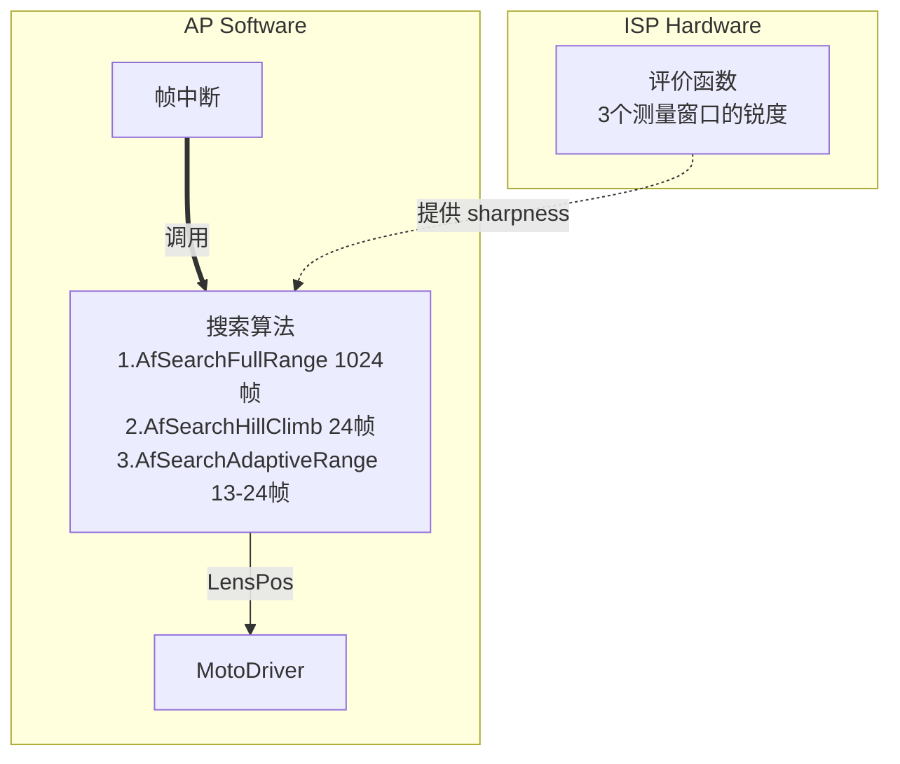
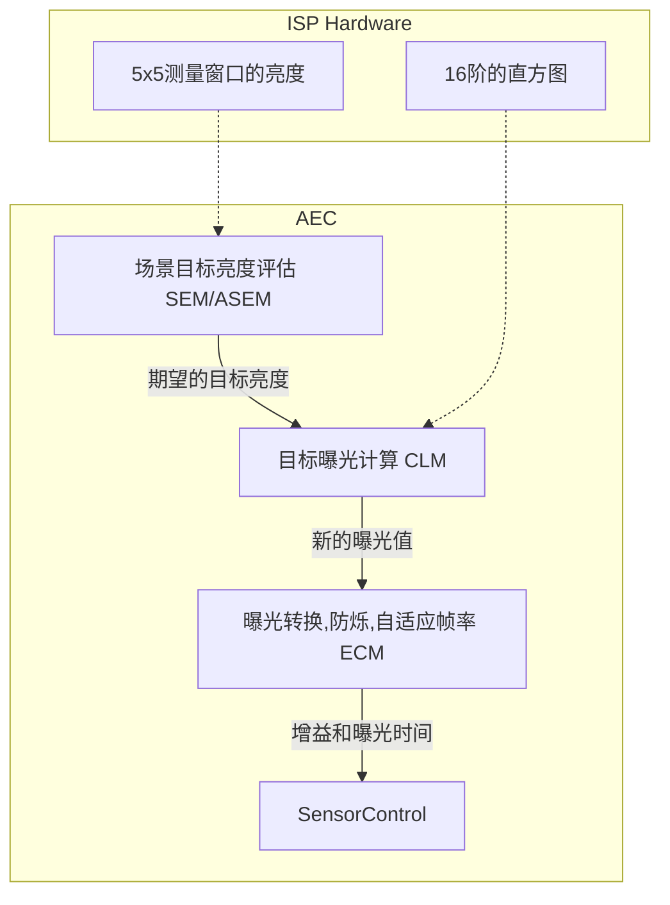

### camera 常用分辨率表

| name | resulostion | pixers |
|------|-------------|--------|
|SIF/QQVGA| 160 x 120    | 19200
|QCIF     | 176 x 144    | 25344
|SIF/QVGA | 320 x 240    | 76800
|CIF 10W  | 352 x 288    | 101376
|VGA 30W  | 640 x 480    | 307200
|SVGA 50W | 800 x 600    | 480000
|XGA 80W  | 1024 x 768   | 786438
|SXGA 130W | 1280 x 1024 | 1310720
|UXGA 200W | 1600 x 1200 | 1920000
|QXGA 300W | 2048 x 1536 | 3145728
|QSXGA 500W| 2592 x 1944 | 5038848
| 600W    | 2816 x 2112  | 2947392
| 700W    | 3072 x 2304  | 7077888
| 770W    | 3200 x 2400  | 7680000
| 800W    | 3264 x 2448  | 7990272
| 1000W   | 3876 x 2584  | 10015584
| 1080p   | 1920 x 1080  | 行扫描(1080i是隔行扫描，先奇再偶)
| 720p    | 1280 x 720   | 行扫描(720i是隔行扫描，先奇再偶)


### RAW Demosaic

#### BilinearDemosaic 双线性算法

| r00 | g00 | r01 | g01 | r02 | g02 |
|-----|-----|-----|-----|-----|-----|
| g10 | b00 | g11 | b01 | g12 | b02 |
| r10 | g20 | r11 | g21 | r12 | g22 |
| g30 | b10 | g31 | b11 | g32 | b12 |

eg:

| pixer | r | g | b |
|-------|---|---|---|
| g11 | (r01+r11)/2 | g11 | (b00+b01)/2 |
| g21 | (r11+r12)/2 | g21 | (b01+b11)/2 |
| b01 | (r01+r02+r11+r12)/4 | (g01+g11+g12+g21)/4 | b01 |
| r11 | r11 | (g11+g20+g21+g31)/4 | (b00+b01+b10+b11)/4 |

### AF (Auto Focus)


shar
#### 评价函数

ISP有3个可配置的测量锐度的窗口。
评价函数为 Sobel 算子法 (Tenengrad), 只使用了 Green pixel

#### 搜索算法

1. AfSearchFullRange
> step为1，从一边搜索到另一边选取最大值

2. AfSearchHillClimb
> 1. step初始化为整个行程的1/8, 快速从一边搜索到另一边
> 2. 将step除-2,在最大点的`[-step, +step]`范围内进行反方向搜索
> 3. 循环第2步，直到step为1

3. AfSearchAdaptiveRange
> 和AfSearchHillClimb类似，只是在单次的搜索时通过和上一次位置的锐度差
> `d=(cur-pre)/(cur+pre)` 来判断趋势，如果是越来越不清晰则直接进行下一步细化搜索

### AEC (Auto Exposure Control)



#### 测光

平均亮度计算有两种,通过ISP_EXP_CTRL寄存器配置：
> 1. `Y = 16 + 0.25R + 0.5G + 0.1094B`
> 2. `Y = (R + G + B) * 85 / 256 = (R+G+B)*0.33203125`

共有25个可配置的测量窗口，测光模式有4种：
> 1. 平均测光，25个窗口一样的权重
> 2. 中心测光，越靠近中心权重越高
> 3. 单点测光，一个窗口
> 4. 多重图样，把最亮和最暗的窗口去掉等，需要微控制器协助

#### SEM (Sence Evaluation Module)

场景亮度评估.

1. 将图分为5个区，1,4当作目标，0,2,3当为背景。
| 0 | 0 | 0 | 0 | 0 |
| - | - | - | - | - |
| 2 | 2 | 4 | 3 | 3 |
| 2 | 4 | 4 | 4 | 3 |
| 2 | 4 | 4 | 4 | 3 |
| 1 | 1 | 1 | 1 | 1 |

2. 目标的平均亮
用`meanLuma0~4`表示5个块的平局亮度
```
meanLumaObj = (5*meanLuma1 + 7*meanLuma4)/12`
```
3. 目标和背景的亮度差 d
```
sumLumaBg = meanLuma0 + meanLuma2 + meanLuma3
sumLumaObj = meanLuma1 + meanLuma4
d = |sumLumaBg - sumLumaObj|
```

4. 计算背光的程度 z
| var | d < 10 |   10 <= d <= 100    | 100 |
| --  |   --   |         --          | --  |
| z   |   0.0  | (d - 10)/(100 - 10) | 1.0 |

5. 计算目标亮度 SemSetPoint
setPoint是由软件设置的目标亮度
```
for i in 25
	mean += (luma[i] * setPoint) / meanLumaObj
mean /= 25
SemSetPoint = (1.0 - z) * setPoint + z * mean;
```

#### ASEM (Adaptive Sence Evaluation Module)

自适应的场景亮度评估，和SEM算法类似，只是步骤一中的目标块区是通过对25个块的亮度进行分析算出。*理论依据不明*

#### CLM (Control Loop Module)

计算新的曝光值。输入参数有：
> 从ISP获取的16阶直方图
> SEM算出的SemSetPoint
> 利用ISP的25个窗口亮度进行中心或平均测光算出的平均亮度 MeanLuma。

计算步骤：
1. 计算亮度差:
` LumaDeviation = |(MeanLuma - SetPoint)/SetPoint|`
2. 判断亮度差是否超过容忍范围, 是则重新计算曝光
`if ( LumaDeviation > (ClmTolerance / 100) ) then Step3`
3. 利用直方图算出新的NewExposure。*理论依据不明*
4. 为了避免曝光值突变，将新曝光值进行一阶滞后滤波
` NewExposure = NewExposure * (1 - Damp) + Exposure * dump;`

#### ECM (Exposure Conversion Module)

将曝光值转换为曝光增益和曝光时间,根据防闪烁设置将曝光时间设置为防烁屏率的整数倍。
`Exposure = gain * ExposureTime`
在保证gain是线性变化的情况下，尽量增大曝光时间并保证增益和曝光时间都在限制的范围内。

#### AFPS (Adaptive frames per second)

自动调节帧率，以满足当前的曝光时间。

### AWB (Auto White Balance)

