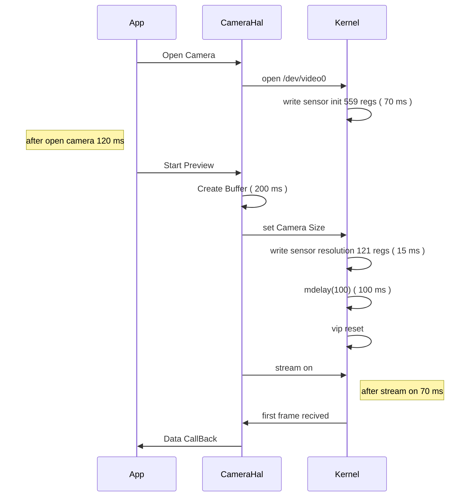

# Camera 启动耗时 （IMX298, I2C 400K）

```mermaid
sequenceDiagram
    participant App
    participant CameraHal
    participant Kernel
    App->>CameraHal: Open Camera
    CameraHal->>Kernel: open /dev/video0
    Kernel->>Kernel: write sensor init 559 regs ( 70 ms )
    Note left of App: after open camera 120 ms
    App->>CameraHal: Start Preview
    CameraHal->>CameraHal: Create Buffer ( 200 ms )
    CameraHal->>Kernel: set Camera Size
    Kernel->>Kernel: write sensor resolution 121 regs ( 15 ms )
    Kernel->>Kernel: mdelay(100) ( 100 ms )
    Kernel->>Kernel: vip reset
    CameraHal->>Kernel: stream on
    Note right of Kernel: after stream on 70 ms
    Kernel->>CameraHal: first frame recived
    CameraHal->>App: Data CallBack
```