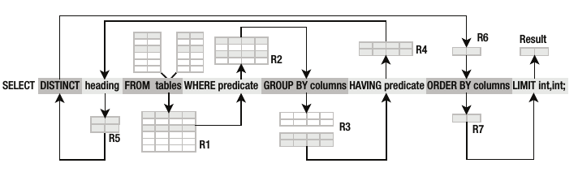
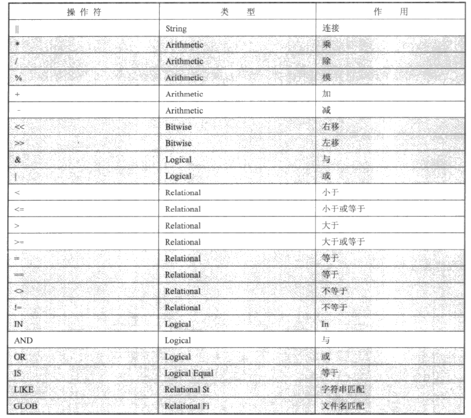

#SQLite

## SQLite中的SQL

### 语法
```sql
select id from foods where name='JujyFruit';
|____| |___________| |_____________________|
 动词       主语              谓语
```
* * *

### 常量

> 'Jerry' 字符常量
> -1, 3.14 数字常量
> x'0abc' 二进制常量

### 关键字，标识符

> select, update, insert, create, drop, begin 等是关键字
> table, index, view 等是标识符

### 注释

```sql
-- This is a comment on one line
/* This is a comment spanning
tow lines */
```
* * *

### 创建表

```sql
create [temp] table table_name (column_definitions [, constraints]);
```

### 修改表

```sql
alter table table_name { rename to name | add column column_def }
```
* * *

### 数据库查询

#### 关系操作

1. **基本操作**
> Restriction (限制)
> Projection (投影)
> Cartesian Product (笛卡尔积)
> Union (联合)
> Difference (差)
> Rename (重命名)

2. **附加操作**
> Intersection (交叉)
> Natural Join (自然连接)
> Assign (赋值)

3. **扩展操作**
> Generalized Projection (广义投影) 
> Left Outer Join (左外连接)
> Right Outer Join (右外连接) -- not support in SQLite
> Full Outer Join (全外连接) -- not support in SQLite

#### select 命令

```sql
select [distinct] heading
from tables
where predicate
group by columns
having predicate
order by columns
limit count,offset;
```

##### SQLite中的select处理流程



##### 值

> 文字值
> 变量
> 表达式
> 函数结果

##### 操作符



```sql
select * from foods where  name='JujyFruit' and type_id=9;
```

##### 限定和排序

```sql
-- like (%) 可以任意0个或多个字符匹配，(_)可以任意单个字符匹配
select id, name from foods where name not like '%ac%p%';

-- asc (默认的升序) desc (降序)，当第一个出现重复，按照第二、第三...排序
-- limit 和 offset 一起使用时，可以用逗号替代offset关键字
select * from foods where name like 'B%'
order by type_id desc, name limit 10 offset 1; -- 等效 limit 1,10
```

##### 函数(Function)和聚合(Aggregate)

> Function: abs(), upper(), lower(), length()
> Aggregates: avg(), count(), min(), max() 对表中的每一行做某种运算

```sql
select id, upper(name),length(name) from foods
where length(name) < 5 limit 5;

select avg(length(name)) from foods;
```

##### 分组(Grouping)

> group by 介于 where 和 select 子句中间

```sql
-- 获取每个type_id组的记录数目
select type_id, count(*) from foods group by type_id;
```
> having 从 group by 中过滤组的方式与 where 子句从 from 子句过滤行的方式相同

```sql
-- 食品小于20个的食品类型
select type_id, count(*) from foods
group by type_id having count(*) < 20;
```
##### 去掉重复

> distinct 处理 select 的结果并过滤掉其中的重复行

```sql
select distinct type_id from foods;
```

##### 多表连接

```sql
-- join_type (inner join, left outer join, cross join)
select heading from left_table join_type right_table on join_condition;

-- 对于第一个表中的每一行， 数据库都要查询第二个表的所有行
-- 交叉连接, 语法不推荐
select foods.name, food_types.name
from foods, food_types
where foods.type_id=food_types.id limit 10;

-- 内连接
select * from foods inner join food_types on foods.id = food_types.id;

-- 左外连接, foods是左表, 所有行都包含在结果中，foods_episodes无法提供的行以null补充
select * from foods left outer join foods_episodes
on foods.id = foods_episodes.food_id;
```

##### 名称和别名

```sql
select f.name as food, e1.name, e1.season, e2.name, e2.season
from episodes e1, foods_episodes fe1, foods f,
     episodes e2, foods_episodes fe2
where
  -- Get foods in season 4
  (e1.id = fe1.episode_id and e1.season = 4) and fe1.food_id = f.id
  -- Link foods with all other epsisodes
  and (fe1.food_id = fe2.food_id)
  -- Link with their respective episodes and filter out e1's season
  and (fe2.episode_id = e2.id AND e2.season != e1.season)
order by food;
```

##### 子查询

> 指select语句中又嵌套select语句

```sql
-- order by 字句，根据所在食品所属组的食品数排序
select * from foods f
order by (select count(type_id)
from foods where type_id=f.type_id) desc;

-- from 字句
select f.name, types.name from foods f
inner join (select * from food_types where id=6) types
on f.type_id=types.id;
```

##### 复合查询

> 涉及的关系的字段数据必须相同
> 只能有一个 order by 字句, 并且在复合查询的最尾部
> union (联合, A和B)、intersect (交叉, 即在A也在B)、except (差集, 在A不在B)

```sql
-- episodes位于前10,但不在3～5季节期间的食品
select f.* from foods f
inner join
  (select food_id, count(food_id) as count from foods_episodes
     group by food_id
     order by count(food_id) desc limit 10) top_foods
  on f.id=top_foods.food_id
except
select f.* from foods f
  inner join foods_episodes fe on f.id = fe.food_id
  inner join episodes e on fe.episode_id = e.id
  where e.season between 3 and 5
order by f.name;
```

##### 条件结果

> case 如果满足的条件有多个，也只执行第一个

```sql
select name, (select
                case
                    when count(*) > 4 then 'Very High'
                    when count(*) = 4 then 'High'
                    when count(*) in (2,3) then 'Moderate'
                    else 'Low'
                end
                from foods_episodes
                where food_id=f.id) frequency
from foods f
where frequency like '%High';
```

##### SQLite中的null

> 只能通过 is null 或者 is not null 检测 null 是否存在， 不能使用 （var = null) 判断
> coalesce 返回第一个非 null 值
> nullif(a,b) 如果a等于b,则返回null，否则返回a

* * *

### 修改数据

#### 插入数据 insert

```sql
insert into table (column_list) values (value_list);

create table foods2(id int, type_id int, name text);
insert into foods select * from foods;
-- 和上面等效
create table foods2 as select * from foods;
```

#### 更新数据 update

```sql
update table set update_list where predicate;

update foods set name='CHOCOLATE BOBKA' where name='Chocolate Bobka';
```

#### 删除数据 delete

```sql
delete from table where predicate;
```
* * *

### 数据完整性

通过约束实现，字段级的约束包括 (not null, unique, primary key, foreign key, check, collate)， 表一级的约束包括 (primary key, unique, check)。一般有四种完整性：
> 域完整性： 涉及控制字段内的直
> 实体完整性： 涉及表中的行，主键唯一性
> 引用完整性： 涉及表之间的行，及外键关系
> 用户定义完整性： 包罗万象

#### 实体完整性

##### 唯一性约束 unique

一个unique约束要求一个或一组字段的所有值互补相同。

##### 主键约束

自动维护主键rowid（别名 \_rawid_, oid)，如果字段类型为 integer primay key 也是对rowid的别名。autoincrement 可以阻止主键“填补空白”, 系统表sqlite_sequence记录该字段但前最大值。

```sql
create table maxed_out (id integer primary key autoincrement, x text);

-- 主键也可以用在其他值
create table pkey(x text, y text, primary key(x,y));
```

#### 域完整性

类型检查、范围检查(default, not null, check等)。

```sql
create table contacts
( id integer primary key,
name text not null collate nocase,
phone text not null default 'UNKNOWN',
unique (name,phone),
check (length(phone)>=7) );
```

#### 引用完整性，外键约束

```sql
create table table_name
( column_definition references foreign_table (column_name)
  on {delete|update} integrity_action
  [not] deferrable [initially {deferred|immediate},]
...);

-- 阻止如果从food_types删除某行导致foods表的id没有父id存在
create table foods(
  id integer primary key,
  type_id integer references food_types(id)
  on delete restrict
  deferrable initially deferred,
  name text );
```

完整的integrity_action定义如下：
> set null: 如果父值被删除或者不存在了，剩余的子值将改为 null
> set default: 如果父值被删除或者不存在了，剩余的子值将修改为默认值
> cascade: 更新父值时，更新所有预知匹配的子值。删除父值时，删除所有子值
> restrict: 更新或删除父值可能会出现孤立的子值，从而阻止事务
> no action: 不干涉操作执行，在整个语句的结尾爆出错误

deferrable字句控制定义的约束是立即强制实施还是延迟到整个事务结束时。
collate关键字定义字段的排序规则，默认是二进制排序，nocase是26个ascii不区分大小写，reverse与二进制的排序规则相反。

#### 存储类

| 名 称  |    说   明   | 识 别 方 法 |
|-------|--------------|-----------|
|integer|整数，全部是数字，最大8字节，<br>自动调节所占字节数|非text且没有小数点和指数|
|  real |实数，8字节的浮点数存储|非text且带有小数点或指数|
|  text |文本，字符数据，支持utf-8和utf-16，<br>默认最大1,000,000,000字节|单引号或双引号括起来的文字|
|  blob |二进制大对象，可以是任意类型的数据，<br>默认最大1,000,000,000字节|x'03aB', 03aB为16进制|
|  NULL |没有值| NULL |

typeof() 可以返回其存储类,不同的类型也可以进行排序：
> null 具有最低的类值
> integer或real高于null, 根据数值比较
> text高于integer和real, 根据该值定义的"排序法“决定
> blob具有最高类值，blob值通过memcmp比较

#### 视图

视图即虚拟表，也成为派生表，其内容实在使用时动态产生的。
```sql
create view name as select-stmt;

create view details as
select f.name as fd, ft.name as tp, e.name as ep, e.season as ssn
from foods f
inner join food_types ft on f.type_id=ft.id
inner join foods_episodes fe on f.id=fe.food_id
inner join episodes e on fe.episode_id=e.id;

drop view name;
```

#### 索引

使用B-Tree加速查询。会增加数据库大小，可能降低insert, update等类似操作的速度。

```sql
create [unique] index index_name on table_name (columns);

create index foods_name_idx on foods (name collate nocase);

drop index index_name;
```

对于下面会在where子句中出现的表达式，SQLite将使用单个字段索引。如果使用多字段索引时，从左到右智能地使用字段，直到无法找出有效条件。
```sql
column {=|>|>=|<=|<} expression
expression {=|>|>=|<=|<} column
column IN (expression-list)
column IN (subquery)
```

#### 触发器

当特定的表发生特定的数据库事件时，触发器执行对应的SQL命令。可用来创建自定义完整性约束，日志改变，更新表等。

```sql
create [temp|temporary] trigger name
[before|after] [insert|delete|update|update of columns] on table
action;

-- 通过 old/new 可以访问更新前后的值。
create temp trigger foods_update_log update of name on foods
begin
  insert into log values('updated foods: new name=' || new.name);
end;
```

##### 错误处理

```sql
-- resolution是解决冲突的策略(abort, fail, ignore, rollback等)
raise(resulution, error_message);
```

###### 可更新的视图

触发器使得创建可更新的视图成为可能。
```sql
create trigger on_update_foods_view
instead of update on foods_view
for each row
  begin update foods set name=new.fname where id=new.fid;
  update food_types set name=new.tname where id=new.tid;
end;
```

* * *

### 事务

事务定义了一组SQL命令的边界，这组命令要么全部执行，要么都不执行。

#### 事务的范围

事务由3个命令控制：
> begin 开始一个事务, begin之后的所有操作都可以取消
> commit 提交事务开始后所执行的所有操作
> rollback 还原begin之后的所有操作

默认SQLite中每条SQL语句都自成事务（自动提交模式）。

```sql
savepoint justincase;

-- 回到某个地方，不用回滚整个事务
rollback [transaction] to justincase;
```
#### 冲突解决

5种冲突解决策略(resolution):
> replace: 将违反约束的记录删除，插入或修改新的记录替代，继续执行, 且不报错
> ignore: 将违反约束的行保持不变，继续执行
> fail: 令终止，不恢复之前的修改
> abort: 默认测略，恢复命令的所有改变并终止命令
> rollback: 或滚当前命令和之前命令的所有改变，终止当前命令和整个事务

```sql
insert or resolution into table (solumn_list) values (value_list);
update or resolution into table set (value_list) where predicate;

-- 在表定义时，可以为单个字段指定冲突解决方法, 语句级方法可以覆盖对象级
create temp table cast(name text unique on conflict rollback);
```

#### 数据库锁

SQLite有5种不通的锁状态：
> 未加锁(unlocked): 访问数据库之前
> 共享(shared): 读取数据，多个连接可以同时获取并保持共享锁
> 预留(reserved): 写数据，一个数据库只有一个预留锁，不阻止获取共享锁
> 未决(pending): 阻止其它连接获取共享锁
> 排它(exclusive): 可以提交修改，之前缓存的修改被写到数据库文件中

#### 事务的类型：

SQLite有三种不通的事务类型，它们以不同的锁状态来启动事务。
> deferred: 默认，直到使用时才获取锁
> immediate: 在begin执行时获取预留锁
> exclusive: 在begin执行时获取排它锁

```sql
begin [ deferred | immediate | exclusive ] transaction;
```

* * *

### 数据库管理

#### 附加数据库

```sql
attach [database] filename as database_name;

detach [database] database_name;
```

#### 数据库清理

```sql
reindex collation_name;
reindex table_name|index_name;
```

#### 数据库配置

所有配置都是用编译指示 ( pragma ) 来实现的。

##### 连接缓冲区大小

```sql
pragma cache_size;
pragma cache_size=10000;
```

##### 获取数据库信息

```sql
-- 列出所有附着的数据库
pragma database_list;

-- 列出索引内字段的相关信息，索引名作为参数
pragma index_info(index_name);

-- 列出表中的索引信息，表名作为参数
pragma index_list(table_name);

-- 列出表中所有字段
pragma table_info(table_name);
```

##### 写同步

通过编译指示 ( synchronous ) 实现。有三种设置：
> full: 在关键点同步所有数据到磁盘， 非常安全，慢。
> normal: 在绝大多数关键点同步数据到磁盘，出现电力中断可能损毁数据库。
> off: 不负责同步数据到磁盘，由操作系统负责，可加速高达50倍，出现电力中断可能损毁数据库。

#### 系统目录

sqlite_master 表是系统表，包含所有表、视图、索引、触发器。

#### 查看查询计划

用 explain query plan 命令查看 SQLite 执行查询的方法，列出查询时访问处理表与数据的具体步骤。
```sql
explain query plan select * from foods where id = 145;
```

* * *